# QikServe
A java API that consumes the given wiremock and renders the content usable, dealing with the promotions as requested
 
 
[URL do GitHub](https://github.com/Wallysoneves/QikServe)

# Resultado

- [Funcionalidades](#funcionalidades)
- [Tecnologias](#tecnologias)
- [Imagens](#imagens)
- - [Notion](#Notion)
- - - [Url](#url-notion)
- - [Postman](#Postman)
- - [Arquitetura](#Arquitetura)
- [Perguntas](#perguntas)

> ## Funcionalidades do projeto

- `Buscar produtos`: É possivel buscar todos os produtos, e também buscar produtos através do `productId`.
- `Criar Pedido`: É posivel criar pedido a partir de 1 produto, passando o `productId` e a `quantidade`que deseja.
- `Buscar Pedido`: Todo pedido criado, ele fica salvo em cache durante 1 hora, possibilitando você de buscar ele durante esse período pelo `orderId`.
- `Atualizar Pedido`: É possivel atualizar o pedido, para isso bastar você ter o id de algum pedido existente, e passar no body o mesmo dados que é necessário para criar um pedido, ele irá fazer o agrupamento caso necessário.
- `Tipo Promoção`: De Acordo com cada promoção que o produto venha a ter, a `API`está preparada para lidar com ela, acatando a regra de cada promoção.
- `Cobertura de Teste`: Para as classes do Service, onde está injetado nossa regra de negócio, temos uma cobertura de aproximadamente 90% do código.

> ## Tecnologias utilizadas

* `Java 17`
* `Intellij Idea`
* `JUnit e Mockito`
* `Maven 3.8.1`
* `SpringDoc OpenApi Swagger`
* `OpenFeign`
* `Arquitetura em camadas`
* `Desing Partten`
* `Notion`
* `Metodologia KanBan`
* `Postman`
* `GitHub e Git`

> ## Imagens

> ### Notion

#### URL Notion
[URL do notion](https://paint-carriage-c96.notion.site/a5317c72dd894a81a459731c74cd607a?v=49aa9c6d181f4161ab624129c4f8cea9&pvs=4)
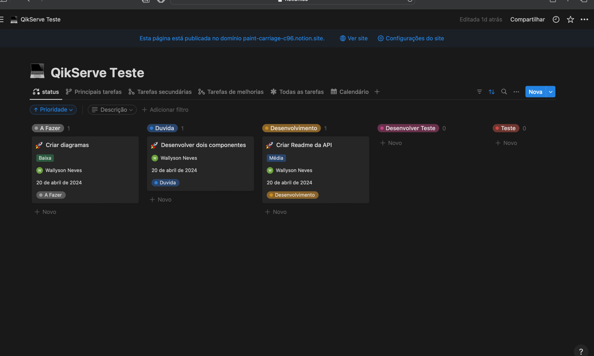

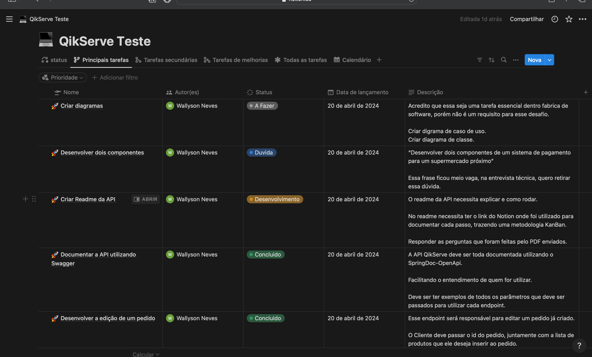

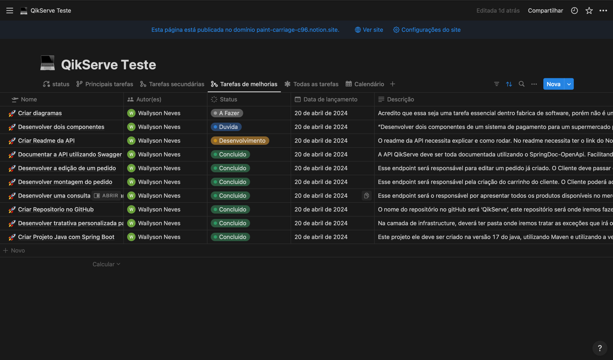

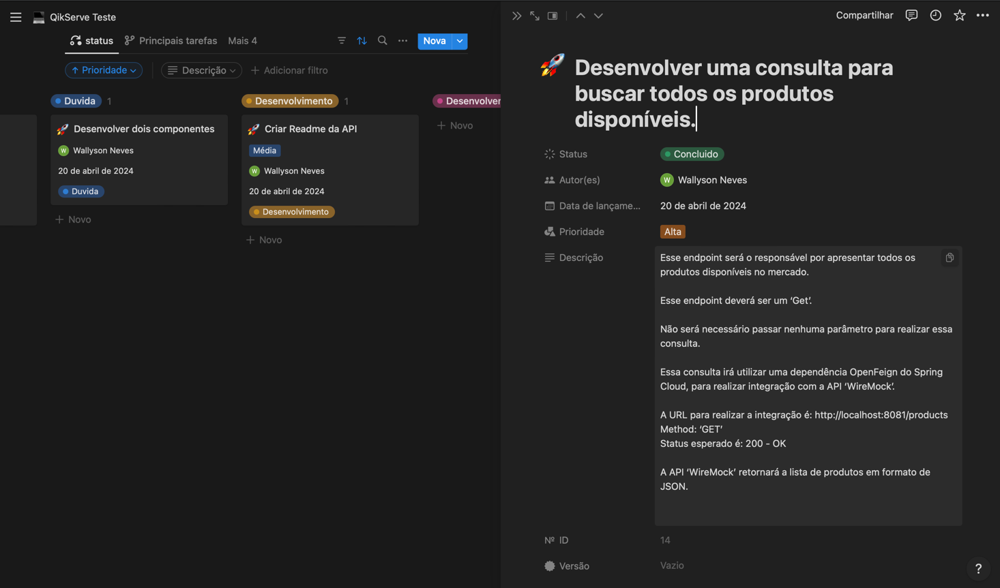

> ### Postman

[Arquivo JSON](./src/main/resources/static/postman/QikServe.postman_collection.json)

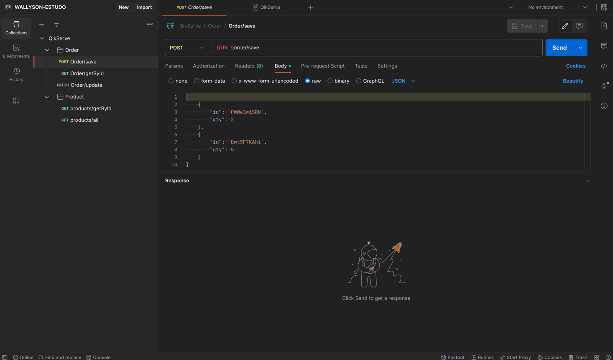

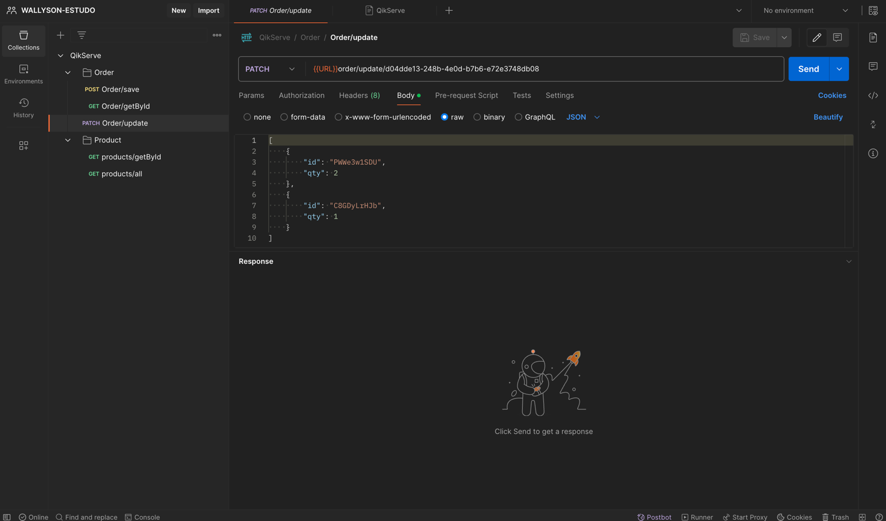

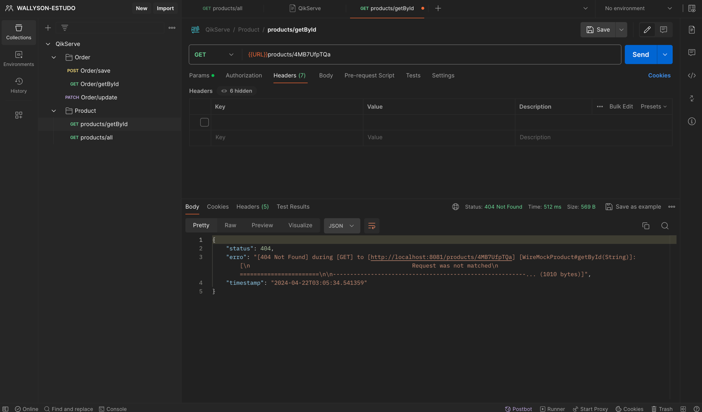

> ### Arquitetura

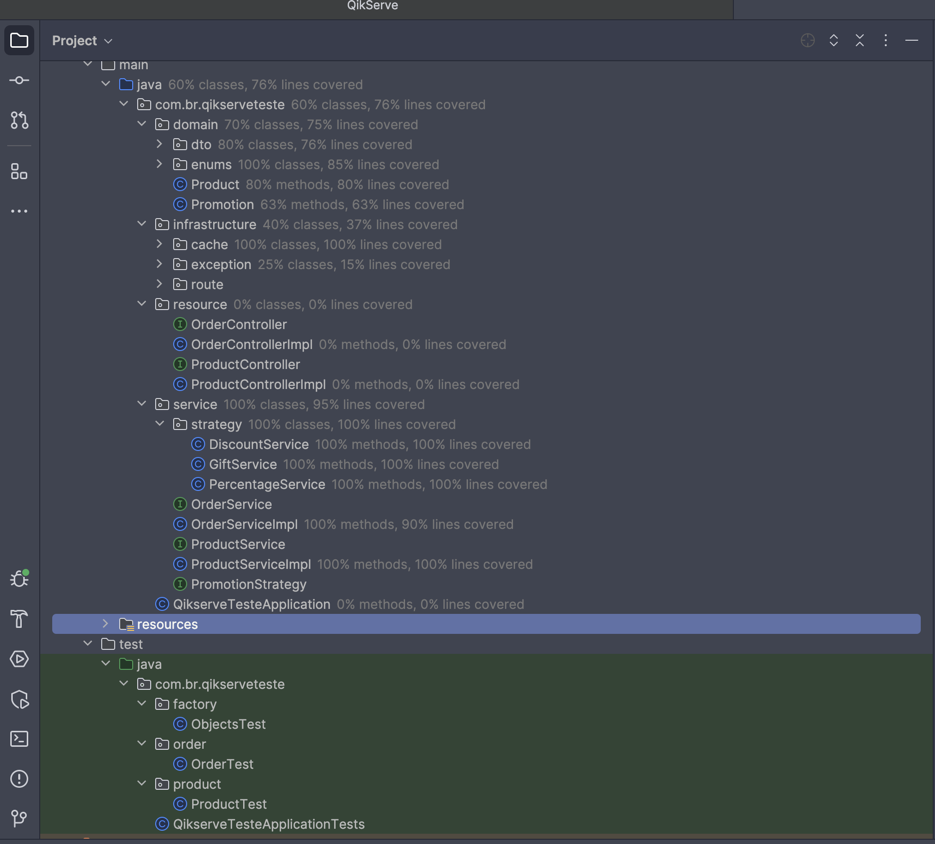

> ### Swagger

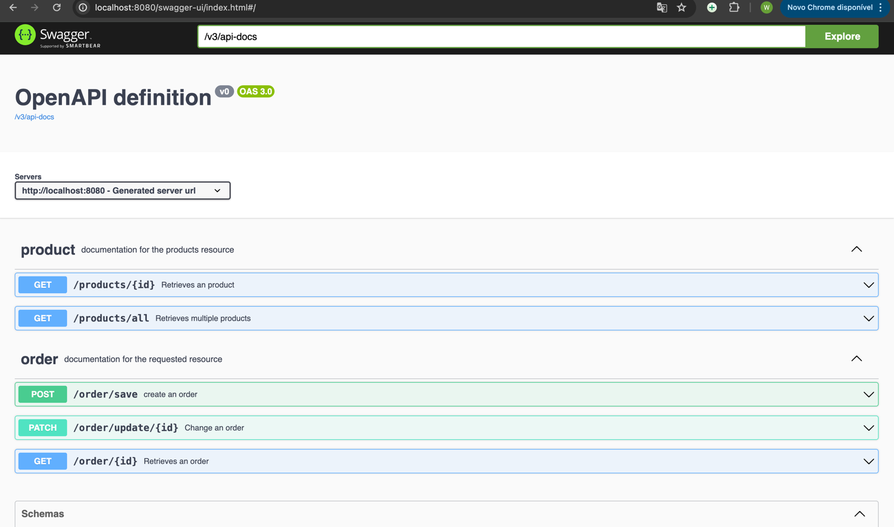

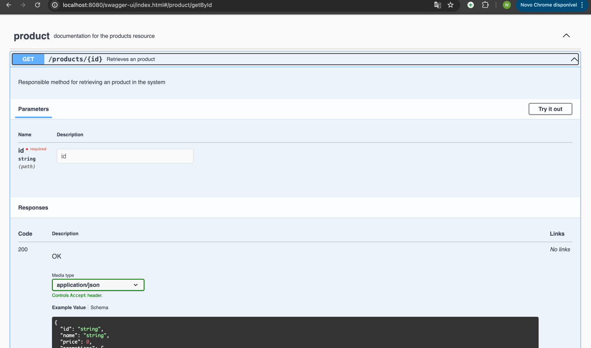

> ## Perguntas

* 1. How long did you spend on the test? What would you add if you had more time?
 
R: Demorei 4 horas para colocar tudo que tinha em mente, esclarecer o maximo possivel no notion, e para implementar demorei 8 horas, totalizando 12 horas. O que posso pensar é que para acompanhar erro pelo console, é um pouco burocrático, poderia buscar uma solução de logs `GrayLog` para melhorar visão em produção, acompanhamento para conseguir analisar melhor.
      
      
* 2. What was the most useful feature that was added to the latest version of your chosen language? Please include a snippet of code that
     shows how you've used it.
 
R: Acredito ser OpenApi, é muito simples e intuitiva, uma API bem documentada não precisa de um desenvolvedor explicando o que cada endpoint faz.

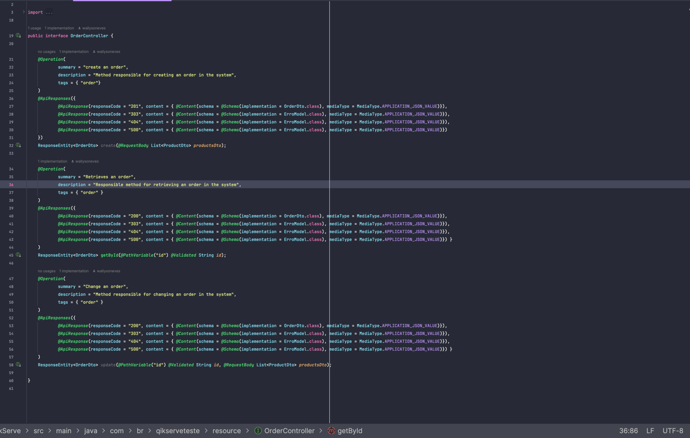

 
 

* 3. What did you find most difficult?
 
R: Entender com clareza todos os requisitos, e extrair para o papel.
      
      
* 4. What mechanism did you put in place to track down issues in production on this code? If you didn't put anything, write down what you
   could do.
 
R: Com a tratativa personalizada, podemos acompanhar todos os erros via console da própria aplicação, existe ferramentas apensa esse cenário `GrayLog` é uma otima ferramenta para cenários de API. Tem muitas outras Application Performance Monitoring (APM) que atende com força esse mercado.
      
      
* 5. The Wiremock represents one source of information. We should be prepared to integrate with more sources. List the steps that we would
   need to take to add more sources of items with different formats and promotions.

 ### Passo 1
 - `Adicionaria mais um tipe de Promoção`
   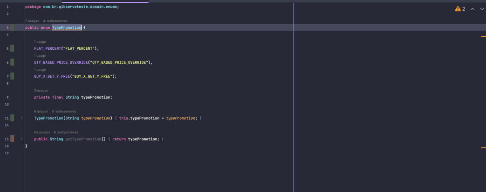

 ### Passo 2
 - `Criar uma class dentro do package strategy, que irá implementar a interface PromotionStrategy. Sua regra dessa promoção ficará dentro dessa class que criar.`
    

### Passo 3
- `Dentro de OrderServiceImpl, adicionar o TypePromotion que você criou novo ao typePromotionMap, com essas alterações você já pode criar pedido com item que tem essa nova promoção.`
  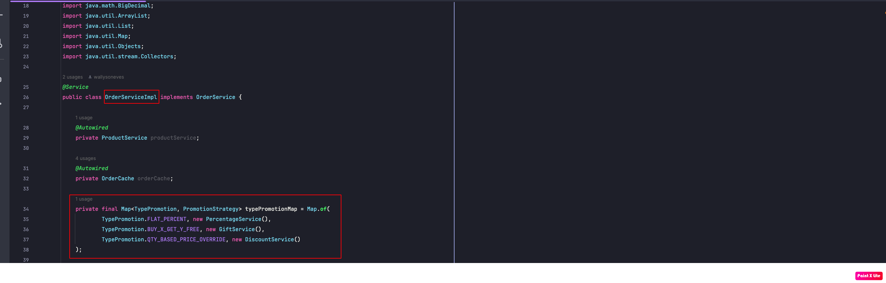

 
 

* 6. Describe the most innovative or inventive endeavor you've undertaken. This could be your idea for a process change, a new product
concept, a unique metric, or a novel customer interface. Do not share confidentail information! Provide context to help us understand the
innovation. What problem were you addressing, and what were the outcomes? Why was solving this problem important, and what was
the impact of the change?

R: Em 2022, por volta de novembro, fui abordado por um colega que compartilhou as dificuldades enfrentadas por sua mãe, uma professora encarregada de calcular as médias finais de seus alunos ao final do ano letivo. Ela lecionava para estudantes do 4º ao 9º ano e precisava calcular a média das notas N1, N2, N3 e N4 de cada aluno, o que demandava uma grande quantidade de tempo e esforço manual. A professora realizava esse processo através de planilhas, recebendo quatro planilhas de cada escola que atendia, e o processo levava de um a dois meses, dependendo do número de turmas que ela ministrava naquele ano.

Diante desse desafio, trabalhei em conjunto com Richard, meu colega, para desenvolver uma solução inovadora. Criamos um software em Java que automatizava o processo de cálculo das médias, permitindo que a professora importasse as quatro planilhas de notas e recebesse uma única planilha com as médias finais de cada aluno. Essa ferramenta eliminou a necessidade de horas dedicadas a cálculos manuais e reduziu drasticamente o tempo necessário para a conclusão dessa tarefa.