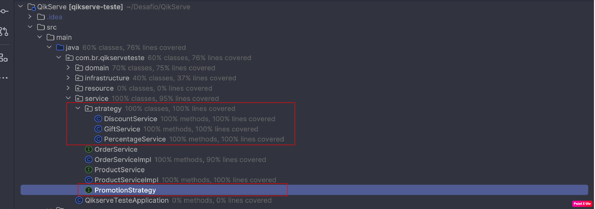

# QikServe
A java API that consumes the given wiremock and renders the content usable, dealing with the promotions as requested
 
 
[GitHub URL](https://github.com/Wallysoneves/QikServe)

# Result

- [Features](#features)
- [Technologies](#technologies)
- [Images](#images)
- - [Notion](#Notion)
- - - [URL](#notion-url)
- - [Postman](#Postman)
- - [Architecture](#Architecture)
- [Questions](#questions)

> ## Project Features

- `Fetch Products`: It's possible to fetch all products, and also search for products by `productId`.
- `Create Order`: It's possible to create an order from 1 product, passing the `productId` and the `quantity` desired.
- `Fetch Order`: Every created order is saved in cache for 1 hour, allowing you to fetch it during that period by `orderId`.
- `Update Order`: It's possible to update the order, for that you just need the id of an existing order, and pass in the body the same data required to create an order, it will group them if necessary.
- `Promotion Type`: According to each promotion that the product may have, the `API` is prepared to handle it, following the rule of each promotion.
- `Test Coverage`: For the Service classes, where our business rule is injected, we have a coverage of approximately 90% of the code.

> ## Technologies used

* `Java 17`
* `Intellij Idea`
* `JUnit and Mockito`
* `Maven 3.8.1`
* `SpringDoc OpenApi Swagger`
* `OpenFeign`
* `Layered Architecture`
* `Design Pattern`
* `Notion`
* `KanBan Methodology`
* `Postman`
* `GitHub and Git`

> ## Images

> ### Notion

#### Notion URL
[Notion URL](https://paint-carriage-c96.notion.site/a5317c72dd894a81a459731c74cd607a?v=49aa9c6d181f4161ab624129c4f8cea9&pvs=4)

> ### Postman

[JSON File](./src/main/resources/static/postman/QikServe.postman_collection.json)

> ### Architecture

> ### Swagger

> ## Questions

* 1. How long did you spend on the test? What would you add if you had more time?
      
     A: It took me 4 hours to put everything I had in mind, clarify as much as possible in the notion, and to implement it took 8 hours, totaling 12 hours. What I can think of is that to track errors via the console, it's a bit bureaucratic, I could seek a logging solution like `GrayLog` to improve visibility in production, enabling better analysis.
      
      
* 2. What was the most useful feature that was added to the latest version of your chosen language? Please include a snippet of code that
     shows how you've used it.
      
     A: I believe it to be OpenApi, it's very simple and intuitive, a well-documented API doesn't need a developer explaining what each endpoint does.

 
 

* 3. What did you find most difficult?
      
     A: Understanding all the requirements clearly and extracting them to paper.
      
      
* 4. What mechanism did you put in place to track down issues in production on this code? If you didn't put anything, write down what you
     could do.
      
     A: With the custom handling, we can track all errors via the application's console itself, there are tools for this scenario like `GrayLog` which is a great tool for API scenarios. There are many other Application Performance Monitoring (APM) tools that serve this market well.
      
      
* 5. The Wiremock represents one source of information. We should be prepared to integrate with more sources. List the steps that we would
     need to take to add more sources of items with different formats and promotions.

### Step 1
- `Add another type of Promotion`
  

### Step 2
- `Create a class within the strategy package, which will implement the PromotionStrategy interface. Your promotion's rule will be inside this class you create.`
  

### Step 3
- `Inside OrderServiceImpl, add the new TypePromotion you created to the typePromotionMap, with these changes you can already create orders with items that have this new promotion.`
  

 
 

* 6. Describe the most innovative or inventive endeavor you've undertaken. This could be your idea for a process change, a new product
     concept, a unique metric, or a novel customer interface. Do not share confidentail information! Provide context to help us understand the
     innovation. What problem were you addressing, and what were the outcomes? Why was solving this problem important, and what was
     the impact of the change?

A: In 2022, around November, I was approached by a colleague who shared the difficulties faced by his mother, a teacher tasked with calculating the final averages of her students at the end of the school year. She taught students from the 4th to the 9th grade and needed to calculate the average of the grades N1, N2, N3, and N4 for each student, which required a significant amount of time and manual effort. The teacher performed this process using spreadsheets, receiving four spreadsheets from each school she served, and the process took one to two months, depending on the number of classes she taught that year.

Faced with this challenge, I worked together with Richard, my colleague, to develop an innovative solution. We created a software in Java that automated the process of calculating the averages, allowing the teacher to import the four grade spreadsheets and receive a single spreadsheet with the final averages of each student. This tool eliminated the need for hours spent on manual calculations and drastically reduced the time required to complete this task.